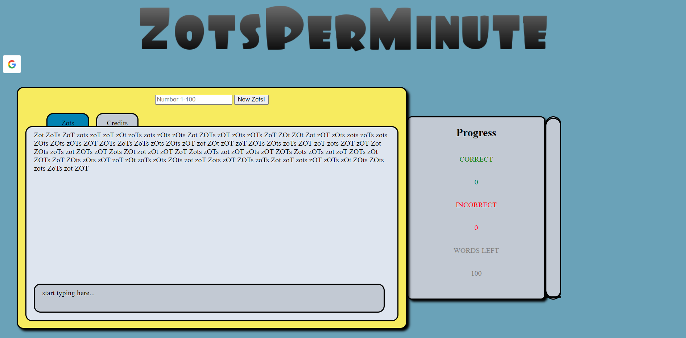

# ZotsPerMinute 

## Contributers: 
 - Brian Le
 - Camille Pon
 - Ismail Bayoumi
 - Robert Lauv 

To play: 
 - Run 'npm install' in console to get dependencies
 - Run 'npm start' in console to run the packages 
 - open on http://localhost:8080

UCI-themed typing game where you try to type various forms of the word "Zot". 

Functions: 
 - Typing game
 - Google sign-in, only works with UCI emails
 - Leaderboard database